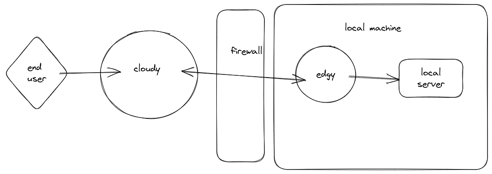

# expose
inspired by ngrok

Allows you to expose any local webserver to the web

# Why
Imagine the following scenario. You're building a website to some customer. The customer wants to see a live version of the site - but you don't want to deploy it to a public server yet. You want to show it to the customer first. You can use expose to expose your local webserver to the web.

# How
download the latest release from [here](), optionally edit config file (edgy.env) and run the app 

Edgy will connect to cloudy and will wait for requests from cloudy, it will give you the url to access your local webserver from the web. You can share that url with anyone and they will be able to access your local webserver.

# Project structure
There are 2 main components 
- [edgy] sits on the local machine , it connects to cloudy and proxies requests comming from cloudy to the specified local server  
- [cloudy] sits in the cloud and proxies incomming requests to a specific edgy, based on the hostname from the request

# Security and Privicy
Currently edgy and cloudy communicate over tcp using a text protocol, so someone can listen in.
The protocol is not encrypted and does not use any authentication. 

# TODO
- [ ] add authentication and encryption to the protocol
- [ ] add support for https 
- [ ] add support for websockets 
- [ ] add support for any tcp connection (might be overkill `ssh -R` is a better solution for that)
- [ ] allow users to reserver a custom subdomain